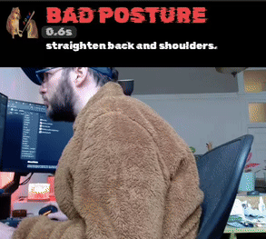

# Slouchless

An application that uses a webcam and vision-language model (VLM) to detect slouching, controllable via a system tray icon. Supports both local models (via vLLM) and OpenAI's Vision API.




## Requirements
- Webcam
- For local models (vLLM): NVIDIA GPU with sufficient VRAM for your chosen VLM
- For OpenAI models: OpenAI API key
- `uv` package manager

## Installation

1. Clone the repository.
2. Install dependencies:
   ```bash
   uv sync
   ```

## Usage

### Using OpenAI (Recommended for Quick Start)

1. Create a `.env` file in the project root:
   ```bash
   OPENAI_API_KEY=your_api_key_here
   SLOUCHLESS_DETECTOR_TYPE=openai
   ```

2. Run the application:
   ```bash
   uv run --active main.py
   ```

### Using Local vLLM Model

1. Ensure you have an NVIDIA GPU with sufficient VRAM
2. Optionally configure the model in `.env`:
   ```bash
   SLOUCHLESS_DETECTOR_TYPE=vllm
   SLOUCHLESS_MODEL_NAME=ybelkada/llava-1.5-7b-hf-awq
   ```

3. Run the application:
   ```bash
   uv run --active main.py
   ```

## Configuration

Configuration is managed via `pydantic-settings` (`src/settings.py`). You can set environment variables (prefixed with `SLOUCHLESS_`) and/or create a `.env` file in the project root.

### Detector Selection

| Variable | Description |
|----------|-------------|
| `SLOUCHLESS_DETECTOR_TYPE` | Detector backend: `vllm` (local models) or `openai` (OpenAI API). Default: `vllm` |

### OpenAI Settings (when `SLOUCHLESS_DETECTOR_TYPE=openai`)

| Variable | Description |
|----------|-------------|
| `OPENAI_API_KEY` | Your OpenAI API key (required for OpenAI detector) |
| `SLOUCHLESS_OPENAI_MODEL` | OpenAI model to use (default: `gpt-4o`) |

### vLLM Settings (when `SLOUCHLESS_DETECTOR_TYPE=vllm`)

| Variable | Description |
|----------|-------------|
| `SLOUCHLESS_MODEL_NAME` | HuggingFace model ID (default: `ybelkada/llava-1.5-7b-hf-awq`) |
| `SLOUCHLESS_GPU_MEMORY_UTILIZATION` | GPU memory utilization (0.0-1.0, default: 0.7) |
| `SLOUCHLESS_QUANTIZATION` | Quantization method (default: `awq_marlin`) |

### Model Settings (shared by both detectors)

| Variable | Description |
|----------|-------------|
| `SLOUCHLESS_PROMPT` | Custom prompt for posture analysis (shared by both vLLM and OpenAI) |
| `SLOUCHLESS_MAX_TOKENS` | Maximum tokens for model response (default: 80) |
| `SLOUCHLESS_TEMPERATURE` | Model temperature (default: 0.2) |

### Camera Settings

| Variable | Description |
|----------|-------------|
| `SLOUCHLESS_CAMERA_DEVICE_ID` | Webcam device index (OpenCV). If unset, Slouchless auto-detects **only if exactly one** camera is found. |
| `SLOUCHLESS_CAMERA_NAME` | Webcam name substring (Linux `/sys/class/video4linux/.../name`) |
| `SLOUCHLESS_CAMERA_RESIZE_TO` | Resize, e.g. `640x480` (or JSON like `[640, 480]`) |

### General Settings

| Variable | Description |
|----------|-------------|
| `SLOUCHLESS_CHECK_INTERVAL_SECONDS` | Seconds between checks (default: 15) |
| `SLOUCHLESS_POPUP_FEEDBACK_INTERVAL_MS` | Inference cadence while the popup is open (default: `3000`). |
| `SLOUCHLESS_POPUP_PREVIEW_FPS` | Preview FPS pushed to the ffplay window (default: `15`). |
| `SLOUCHLESS_LOG_LEVEL` | Logging level: `DEBUG`, `INFO`, `WARNING`, `ERROR`, `CRITICAL` (default: `INFO`). |

## Testing the OpenAI Detector

To quickly test the OpenAI detector without running the full application:

```bash
# Make sure OPENAI_API_KEY is set in your .env
uv run python test_openai_detector.py
```

This will use an existing debug frame image to test the OpenAI vision API.

## Popup live feedback (✅/🚨/⚠️)

Enable the ffplay feedback popup (live feed + LLM feedback overlay):

```bash
export SLOUCHLESS_POPUP_FEEDBACK_INTERVAL_MS=500
```

Notes:
- The popup uses an ffplay window and streams an overlay-rendered video feed from Python.
- A GUI session is required (DISPLAY/WAYLAND_DISPLAY) and `ffplay` must be installed.

